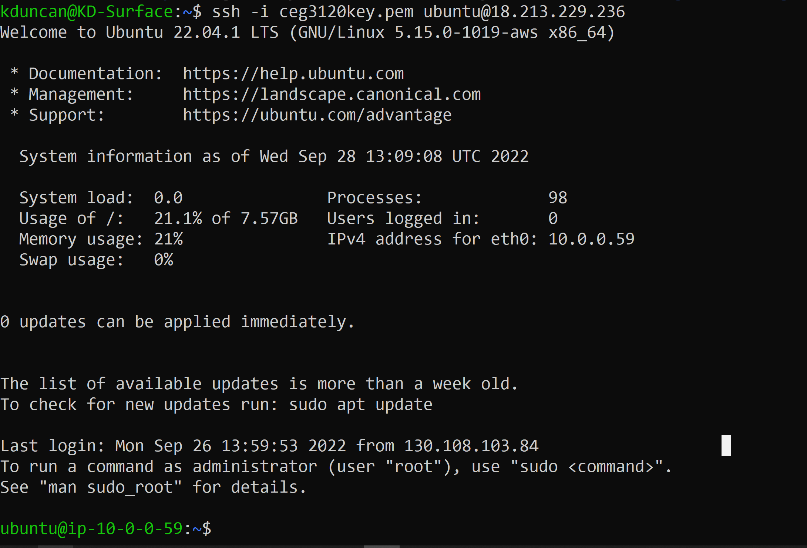

# Git Guide for Project 0

## Command line git

- status
  - Shows status of the local repository. This status includes:
    - number of local commits that have not been synced with remote (GitHub)
    - list of files in local folder than are NOT being tracked by git
    - list of files in local folder that have changes that need to be committed
  - `git status`
- clone
- add
- rm
- commit
- push
- fetch
- merge
- pull
- branch
- checkout
- ~~init~~
- ~~remote~~

## git files & folders

- .git folder
- .gitignore file
- ~~.git/hooks~~

## GitHub

- Pull requests
- SSH authentication to repositories
- ~~Actions~~
